# CapturaClipA2

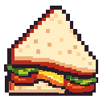

画面の一部を切り取って、最前面に貼り付けておくための Windows 用ツールです。

別のウィンドウに切り替えると見えなくなってしまう情報を、画面の隅に置いたまま作業を続けられます。切り取った後は、そのまま線を引いたり、文字を入れたり、隠したい所をぼかしたりできます。

## 動作環境

Windows 10 / 11（64bit）。追加のランタイムは不要です。実行ファイル 1 つで動きます。

### はじめて起動するとき

**「WindowsによってPCが保護されました」と出ます。** コード署名をしていないためで、「詳細情報」→「実行」で起動できます。

**ウイルス対策ソフトが反応することがあります。** スポイトを使っている間だけ、マウスの入力を横取りするための仕組み（低レベルマウスフック）を仕掛けます。キーロガーなどが使うものと同じ API なので、まれに検知の対象になります。スポイトを終了すると外れます。

## 使い方

起動するとカーソルが十字に変わり、画面が固定されます。

### 領域選択中

| 操作 | 動作 |
|---|---|
| ドラッグ | 範囲を選んでキャプチャ |
| クリック | カーソル下のウィンドウ全体をキャプチャ |
| Ctrl + クリック | 同上。タイトルバーと枠を除いた中身だけ |
| 右クリック / Esc | キャンセルして終了 |

画像ファイルを引数に渡して起動すると、キャプチャせずにその画像を開きます。実行ファイルに画像をドロップしても同じです。

### キャプチャウィンドウ

既定ではタイトルバーがなく、常に最前面に表示されます。**右クリックでメニュー**が開き、すべての機能に辿れます。ショートカットはメニューにも表示され、設定で変更できます。

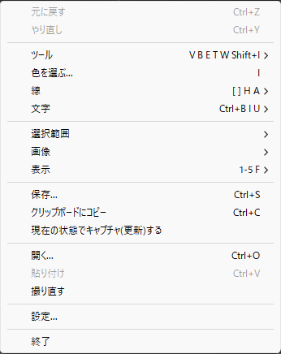

項目は「それが何に対して働くか」で並んでいます。直前の編集 → これから描くもの → 画像そのもの → 画像の出し入れ → プログラム、の順です。

ツールによって左ドラッグの意味が変わります。

| キー | ツール | 左ドラッグ |
|---|---|---|
| V | ビュー | 画像をスクロール |
| B | ペン | 描画 |
| E | 消しゴム | なぞった線を消す |
| T | テキスト | （クリックで入力開始） |
| W | 範囲選択 | 矩形を選ぶ |
| L | 投げ縄 | 手で囲って選ぶ |
| Shift + I | スポイト | 画面から色を拾う |

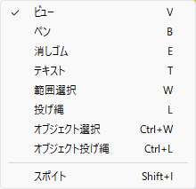

**共通の操作**

| 操作 | 動作 |
|---|---|
| 中ドラッグ | ウィンドウを移動 |
| 四辺・四隅をドラッグ | ウィンドウをリサイズ |
| Space を押しながら左ドラッグ | 一時的にスクロール |
| Ctrl + ホイール | ズーム（Shift 併用で微調整）。何を中心にするかは設定で選べます |
| ホイール | 不透明度 |

この 4 つ（スクロール・ウィンドウ移動・ズーム・不透明度）は、キーと同じように**設定で割り当てを変えられます**。
| 1 〜 5 | 倍率を 100 / 200 / 300 / 400 / 500% に |
| カーソルキー | スクロール |
| F | ウィンドウを画像サイズに合わせる |
| X | しばらく隠す（下を見たいとき。時間が経つと自分で戻ります） |
| Ctrl + Z / Ctrl + Y | 元に戻す / やり直し（回数制限なし） |
| Ctrl + O | 画像ファイルを開く |
| Ctrl + V | クリップボードの画像を貼り付け |
| Ctrl + S | 名前を付けて保存 |
| Ctrl + C | クリップボードにコピー |
| 右クリック | メニュー |

ウィンドウに画像ファイルをドラッグ＆ドロップしても開けます。開く・貼り付けは今の画像を**置き換えます**（自動保存が有効なら、置き換える前に保存されます）。

保存とコピーには、描いた線・文字・ぼかしがすべて反映されます。

### 拡大縮小で動かさない所

設定の「全般」で 3 通りから選べます（`ZoomAnchor`）。

| 値 | 動作 |
|---|---|
| `TopLeft` | 表示領域の左上を保ちます。**ウィンドウは動きません**（既定） |
| `Cursor` | カーソルの下にある点を保ちます。狙った所に寄れます |
| `Center` | 表示領域の中央を保ちます |

`Cursor` のときは、**ホイールを回し続けている間を 1 回の操作として扱い、最初に回した時点の位置を保ちます**。回している最中に手が少し動いても中心はぶれません。手を止めて（0.4 秒ほど）別の場所で回すと、そこが新しい中心になります。

保つために、まず画像をスクロールし、それで足りないときはウィンドウ自体が動きます。ウィンドウが画面いっぱいまで大きくなっている間は、スクロールだけで足りるのでウィンドウは動きません。**`Cursor` では中心を優先するので、ウィンドウが画面の外へはみ出すことがあります。** 中心にした点は必ず画面内に残るので、見失うことはありません。

キーボードの `1`〜`5` と右クリックメニューの倍率指定にはカーソルがないので、`Cursor` を選んでいるときは**画面の中央**を保ちます。

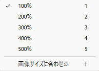

## 描く

| 操作 | 動作 |
|---|---|
| Shift + ドラッグ（ペン） | 直線。引いている間に Alt で角度が揃い、Shift の押し直しで折れ曲がります |
| `[` `]` | ブラシ・消しゴムのサイズ |
| R（描いている間） | 矢印の頭を付ける |
| Shift + 1 〜 8 | クイックカラー |
| A | アンチエイリアスの切り替え |
| H | 蛍光マーカーの切り替え |
| I | カラーパレット |
| Shift + I | スポイト |
| Alt + ドラッグ | 押している間だけスポイト。離すと元のツールへ戻ります |

ペンと消しゴムのときは、カーソルに**実サイズの円**が出ます。この円が**オレンジ**ならアンチエイリアスなし、**白**ならありです。

太さ・蛍光マーカー・アンチエイリアス・筆圧はメニューの「線」からも切り替えられます。

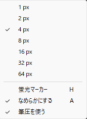

### 蛍光マーカー

`H` でペンが蛍光マーカーになります。別のツールではないので、太さと色はペンと共通です。

半透明で塗るので下の文字が読めます。1 ストロークはまとめて合成されるため、**線が自分自身と交差しても、そこだけ濃くなることはありません**。

### 直線の角度と折れ線

`Shift` を押しながら引くと直線になります。**押し始めたときに決まるので、途中で `Shift` を離しても直線のままです。**

| 操作 | 動作 |
|---|---|
| Alt（直線を引いている間） | 角度を一定ずつに揃える。既定は 15 度 |
| Shift をもう一度押す（同上） | そこで**折り曲げて**、続けて引く |

**Alt は引き始めてから押してください。** `Shift + Alt` を押した状態でクリックすると、直線ではなくスポイトになります（`Alt + クリック` が色を拾う操作のため）。

揃える角度は設定の「描く」タブで変えられます。`0` にすると揃えません。

**Shift の押し直しは、ボタンを離さずに角を作る操作です。** 押すたびにそこが折れ目になり、次の線がそこから続きます。折れ目の前後で太さはつながるので、段差にはなりません。Alt と併用すれば、15 度ずつの折れ線が引けます。

### 直線の太さ

直線は筆圧ではなくブラシサイズで両端の太さを決めます。ペンを置く力を狙うのは難しいためです。

| 操作 | 動作 |
|---|---|
| `[` `]`（直線を引いている間） | **終点**の太さ |
| Ctrl + `[` `]`（同上） | **始点**の太さ |

引いている間、タスクバーに `Line 4 → 12px` と両端の太さが出ます。両端に差をつければ、入り抜きのある線になります。

### 矢印

**線を引いている最中に `R` を押すと、そこに矢印の頭が付きます。** 向きは、そのとき線が進んでいた向きです。1 本の線に何個でも置けます。直線でも同じで、狙い直せば頭も端に付いてきます。

**頭の大きさはその場所の線の太さで決まります。** 押す直前に `[` `]` で太さを変えれば、頭だけ大きさを変えられます。筆圧で細くなった所に置けば頭も小さくなります。矢印だけの倍率という操作はありません ―― 既にあるもので足りるためです。

形は設定の「描く」で変えられます。

| 項目 | 意味 | 既定 |
|---|---|---|
| 矢印の大きさ | 線の太さの何倍の幅にするか | 3 |
| 矢印の長さ | 幅の何倍の長さにするか | 1.2 |
| 矢印の角の丸み | 幅の何倍の半径で角を落とすか | 0.15 |

**すべて頭の幅を基準にしているので、線の太さを変えると全部が比例して動きます。** 角の丸みを変えても大きさと長さは変わりません。

### ペンタブレット

筆圧に対応しています（Windows Ink 経由。ペンタブ側の設定で有効にしてください）。フリーハンドで描くと筆圧で線の太さが変わります。**ペンを裏返すと消しゴム**になり、離すと元のツールに戻ります。筆圧の ON / OFF は右クリックメニューの「線」から切り替えられます。

### 色

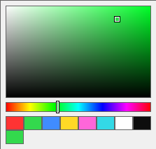

`I` でカラーパレットが開きます。彩度・明度の面と色相バー、その下にクイックカラーと履歴が並びます。**履歴の左端が今の色**で、作業中はリアルタイムに変わります。パレット外をクリックで確定、`Esc` で取り消しです。

`Shift + I` はスポイトです。カーソルの周りを拡大した窓が出て、拾えるピクセルに枠が付き、色の値が表示されます。**画面のどこからでも拾えます**。この間、クリックは下のアプリに届きません。右クリックでやめられます。

**ボタンを押したまま動かすと、拾う色が付いてきます。** 決まるのは離した位置の色なので、拡大窓を見ながら狙いを定めて離してください。

`Alt + ドラッグ`でも同じスポイトが使えます。**押している間だけスポイトになり、離すと元のツールへ戻ります。** 描いている途中に色を拾いたいときはこちらが速いです。拡大窓が出ることも、画面のどこからでも拾えることも `Shift + I` と同じで、違うのは呼び出し方だけです。

**Alt は押してからクリックを始めてください。** 描き始めたあとに押す Alt は直線の角度を揃える操作なので、意味が変わります。

## 文字

`T` でテキストツールに切り替え、クリックした位置から入力します。日本語入力（IME）に対応しています。

| 操作 | 動作 |
|---|---|
| クリック | その位置に入力を開始 |
| Enter | 改行 |
| 入力欄の外をクリック / Ctrl + Enter / Esc | 確定 |
| 既存のテキストをクリック | **再編集**（内容が入力欄に戻ります） |
| 既存のテキストをドラッグ | 位置を動かす |
| 入力中に右クリック | 書式のメニュー |

入力欄は**確定後と同じフォント・サイズ・色**で表示されるので、そのまま仕上がりを確認できます。

**一部だけの書式変更に対応しています。** 選んだ範囲だけ、太字・斜体・下線・打ち消し線・色・サイズ・フォントを変えられます。何も選ばずに指定すると、そこから先に打つ文字に適用されます。

| 操作 | 動作 |
|---|---|
| Ctrl + B / I / U | 太字 / 斜体 / 下線 |
| `[` `]` | 文字サイズ |

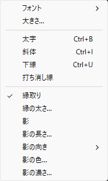

再編集したテキストは**作成時の書式を保ちます**（文言だけ直したつもりが色やサイズまで変わる、ということがありません）。中身を全部消して確定すると、そのテキストは削除されます。

テキストツールを抜けると **IME は直接入力に戻ります**。日本語入力のままだと 1 キーのショートカットが打てなくなるためです。

## 範囲を選ぶ

`W` で**範囲選択**（矩形をドラッグ）、`L` で**投げ縄**（手で囲う）です。投げ縄は離した時点で自動的に閉じます。

**2 つは同じ範囲を共有します。** `W` と `L` を行き来しても選んだものは消えません。矩形で大きく取ってから投げ縄で細かく足す、といった使い方ができます。

| 操作 | 動作 |
|---|---|
| ドラッグ | 引き直す（前の範囲は消える） |
| `Shift` + ドラッグ | **足す**（離れた場所を同時に選べる） |
| `Alt` + ドラッグ | **引く**（穴を開ける）。引こうとしている範囲が赤い枠で出ます |
| クリック | 選択を解除 |

`Ctrl` は使いません。設定でスクロールやウィンドウ移動に割り当てられるためです。

**範囲選択と投げ縄では、`Alt` + ドラッグでスポイトが起動しません**（`Alt` は「引く」に使うため）。他のツールでは従来どおり起動し、これらのツールでも `Shift + I` でスポイトは使えます。

範囲が消えるのは、**引き直したとき**と、**範囲選択・投げ縄以外のツールに切り替えたとき**です。その場で消したいときは右クリックメニューの「選択を解除」を使います。

**選択を変えた操作は 1 つずつ `Ctrl+Z` で戻せます。** 引き直しも、足し引きも、解除も、**別のツールに切り替えて消えた分**も戻ります（ツールの切り替えそのものは記録しません）。

**戻すとそのときのツールにも切り替わります。** 選択枠は範囲選択・投げ縄でしか描かれないので、そうしないと何が戻ったのか見えないためです。

## 色を置く・隠す

範囲を選んでから、右クリックメニューの「選択範囲」で選びます。

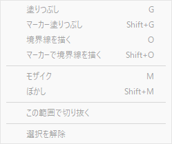

| 項目 | キー | 動作 |
|---|---|---|
| 塗りつぶし | `G` | 今の色で塗る |
| マーカー塗りつぶし | `Shift + G` | 同じ色を薄く塗る（下が透ける） |
| 境界線を描く | `O` | 範囲の縁に線を引く |
| マーカーで境界線を描く | `Shift + O` | 同じ線を薄く引く |
| モザイク | `M` | 範囲を隠す |
| ぼかし | `Shift + M` | 同上 |

**キーは選択範囲があるときだけ働きます。** 範囲は範囲選択・投げ縄を離れると消えるので、他のツールでは押しても何も起きません。`Shift` が付くほうが薄いほう、という対応で揃えてあります。

**塗りと線はペンの設定を使います** ―― 色・線幅（`[` `]`）・なめらかにする（`A`）。覚えることを増やさないためです。塗りと線は**消しゴムで消せます**（線は線に触れたとき、塗りはその上をなぞったとき）。

**離れた場所を選んで塗ると、場所ごとに別々に消せます。** 重なっている場所どうしは 1 つとして扱います（分けるとマーカーで重なりだけ濃くなるため）。

**選んだ形どおりに効きます。** 複数選択でも、穴を開けた形でも、投げ縄の形でも同じです。

### 隠す

**下に描いた線や文字も一緒に隠れます。** 隠れる中身は**かけた時点の見た目で決まる**ので、後から下の線を消しても、隠れた中の線は消えません。逆に、かけた**後**に描いたものは上に乗ります。

かけた直後は `[` `]` で**強さを変えられます**。結果を見ながら決められるので、あらかじめ数字を当てる必要がありません。前回の値は次のときに引き継がれます。`[` で 0 まで下げると効果が消えます。

**選んだ範囲はかけた後も残ります。** モザイクをぼかしに変えたい、もう一度重ねたい、といったときに同じ範囲を引き直さずに済みます。切り替えた場合は、同じ範囲に次の効果としてかかります（下の効果の上に乗ります）。

## 画像を変える

右クリックメニューの「画像」から、回転・反転・連結ができます。「選択範囲」からは切り抜きができます。

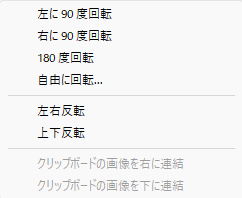

| 項目 | 動作 |
|---|---|
| 左に / 右に 90 度回転、180 度回転 | 画質は落ちません |
| 自由に回転... | 角度を決めて回します。空いた角は黒で埋めます |
| 左右反転 / 上下反転 | |
| クリップボードの画像を右に / 下に連結 | 短い側は黒で埋めます |
| この範囲で切り抜く（選択範囲） | |

### 自由に回転

スライダーか数値で角度を決めます（−360 〜 360 度）。**決めている間、ウィンドウの絵がそのまま回ります。** 拡大率は変えないので、細かい所まで見たまま確かめられます。**ウィンドウからはみ出して見えなくなる部分も、決めたときには切れずに残ります** —— 画像が角に合わせて大きくなるためです。

回すと角が空くので、**黒で埋めます**。

画像が大きくなるぶんウィンドウも広がります。**そのときどこを動かさないか**は設定の「回転で動かさない所」で選べます。既定は**中央**（四方へ均等に広がる）で、**左上**にするとウィンドウの左上が動かず右下へ伸びます。中央のときは、広がった結果ウィンドウが画面の端からはみ出すことがあります。

**任意の角度で回すと、画像を作り直すため少しぼやけます。** 90 度・180 度がピクセルを入れ替えるだけなのに対して、それ以外の角度では計算し直すためです。**繰り返すほど失われる**ので、回すのは一度で決めてください。**プレビューを動かしている間は劣化しません**（毎回元の画像から作り直しているためです）。90 度・180 度はメニューの項目を使えば劣化しません。

これらは**描いたものを画像に焼き込みます**。線や文字は元の形に対して置かれているので、形が変わった後も別々に保つことができないためです。焼き込む前の状態は `Ctrl + Z` で戻せます（画像ごと戻ります）。

メニューの**「現在の状態でキャプチャ(更新)する」**（「クリップボードにコピー」の下）は、表示されているとおりを新しい画像にします。ズームした状態で使うと**実際に拡大された画像**になります。画面上で大きく見えているだけの状態を、そのまま実体にできます。これも描いたものを焼き込みます。

メニューの「撮り直す」は、今のキャプチャを捨てて、範囲選択からやり直します。

## 設定

右クリックメニューの「設定...」から開きます。タブは 全般 / 描画 / 色 / 文字 / 保存 / ウィンドウ / 操作の割り当て です。一番下の「設定をリセット」ですべて初期値に戻せます。

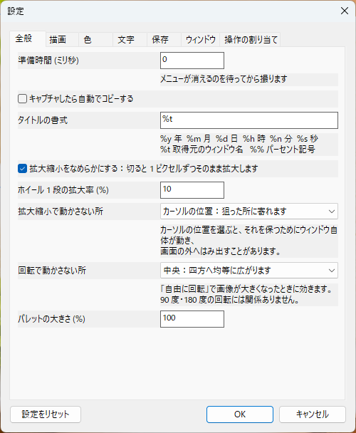

| タブ | 画面 |
|---|---|
| 描画 | 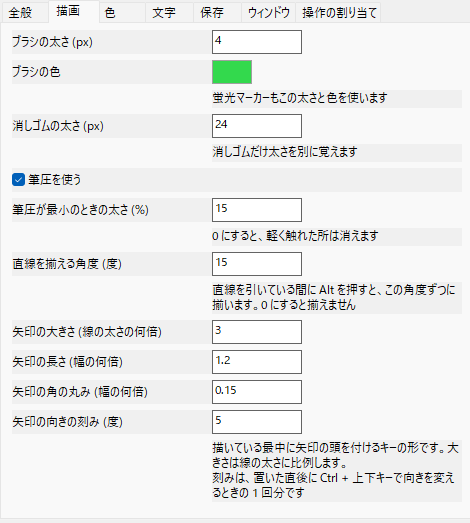 |
| 色 | 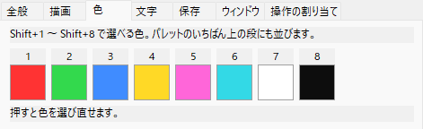 |
| 文字 | 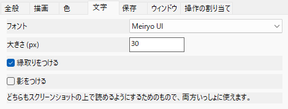 |
| 保存 | 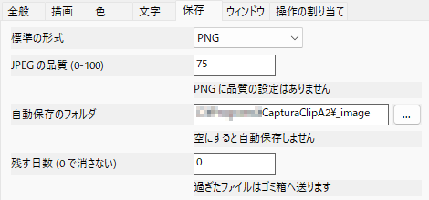 |
| ウィンドウ | 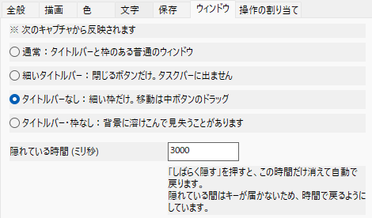 |

設定は実行ファイルと同じ場所の `CapturaClipA2.ini` に保存されます。初回起動時に説明付きで作られるので、テキストエディタで直接編集しても構いません。設定は起動のたびに読み込まれます。

| 節 | 項目 | 内容 |
|---|---|---|
| Capture | `PreparationMs` | 画面を取り込むまでの待ち時間。メニューのフェードが残るときに増やす |
| | `CopyOnCapture` | キャプチャと同時にクリップボードへコピー |
| Text | `FontFamily` `FontSize` | テキストのフォントとサイズ |
| | `Shadow` `Outline` | テキストの影・縁取り。雑多な背景でも読めるように |
| Drawing | `UsePenPressure` | 筆圧で線の太さを変えるか |
| | `PressureMinScale` | 最も弱い筆圧での太さの割合。`0.15` なら 15% |
| | `PenWidth` `PenColor` | ブラシの初期サイズと色 |
| | `EraserWidth` | 消しゴムの初期サイズ。ブラシとは別に覚えます |
| | `LineSnapDegrees` | 直線を引いている間に Alt を押したとき揃える角度。`0` で揃えません |
| | `ArrowScale` `ArrowAspect` `ArrowRounding` | 矢印の頭の幅・長さ・角の丸み。いずれも頭の幅が基準 |
| Colors | `Color1` 〜 `Color8` | Shift+1 〜 8 の色。パレット上段にも並びます。`#RRGGBB` |
| Appearance | `TitleFormat` | タイトルの書式。`%y %Y %m %d %h %n %s %t` が使える |
| | `SmoothScaling` | 拡大時の補間。`0` にするとドットがはっきり見える |
| | `ZoomStepPercent` | ホイール 1 段あたりの倍率変化 |
| | `ZoomAnchor` | 拡大縮小で動かさない所（後述）。`TopLeft` / `Cursor` / `Center` |
| | `RotateAnchor` | 自由に回転して画像が大きくなったとき動かさない所。`TopLeft` / `Center` |
| | `PaletteScalePercent` | カラーパレットの大きさ（50〜300）。高 DPI で調整用 |
| | `WindowFrame` | ウィンドウの枠（後述） |
| | `HideDurationMs` | 「しばらく隠す」で消えている時間（ミリ秒） |
| Save | `DefaultFormat` | 保存形式の既定値（PNG / JPEG / BMP） |
| | `JpegQuality` | JPEG の画質（0〜100） |
| AutoSave | `Folder` | 自動保存先。空なら自動保存しない。`C:\Captures\%y-%m` のように書式が使える |
| | `HistoryDays` | 自動保存したファイルを残す日数。`0` なら消さない |
| Shortcuts | 各コマンド | `Ctrl+S` `B` `Shift+F1` のように書きます。空ならキーなし |
| Mouse | `Scroll` `MoveWindow` | `LeftDrag` `MiddleDrag` `RightDrag` `Ctrl+LeftDrag` `Ctrl+MiddleDrag` `Shift+MiddleDrag` |
| | `Zoom` `Opacity` | `Wheel` `Ctrl+Wheel` `Shift+Wheel` `Alt+Wheel` |

### ウィンドウの枠

`WindowFrame` は 4 通りです。**次のキャプチャから反映されます。**

| 値 | 見た目 |
|---|---|
| `Normal` | タイトルバーと枠のある普通のウィンドウ |
| `ThinTitleBar` | 閉じるボタンだけの細いタイトルバー。タスクバーに出ません |
| `NoTitleBar` | 細い枠だけ（既定） |
| `NoFrame` | 枠もなし |

タイトルバーがない場合、つかむ所がないのでウィンドウの移動は中ボタンのドラッグです。

### しばらく隠す

`X` を押すと、ウィンドウが完全に消えて、`HideDurationMs`（既定 3 秒）で自動的に戻ります。下に隠れているものを見たいときのためのものです。

**押している間だけ隠す、という形にはできません。** 消えたウィンドウはキーボードのフォーカスを失うので、キーを離したことを知る手段がなくなり、戻ってこられなくなります。時間で戻るのはそのためです。

戻るときはアクティブになりません。隠している間に触っていたアプリから、入力を横取りしないためです。

### 操作の割り当て

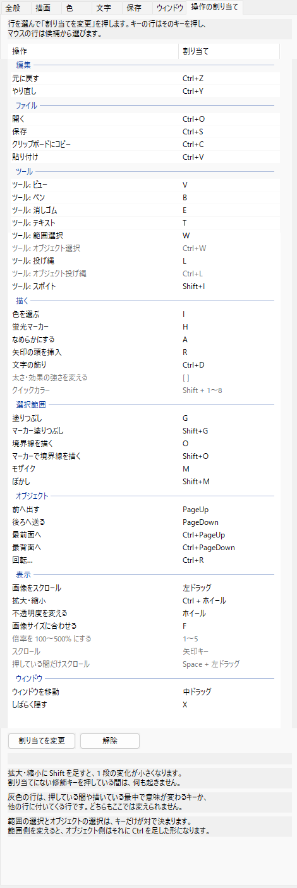

設定の「操作の割り当て」タブに、キーとマウスの両方が並びます。「どうやってスクロールするか」は、答えがキーでもドラッグでも同じ 1 つの疑問なので、探す場所を 2 つに分けていません。項目は 編集 / ファイル / ツール / 描く / 表示 / ウィンドウ に分かれています。

行を選んで「割り当てを変更」を押します。キーの行はそのキーを押し、マウスの行は候補から選びます。「解除」で割り当てなしにできます。

**重複するとその行が赤くなり、直すまで OK を押せません。** 同じキーが 2 つの操作に付いていると、どちらかが必ず反応しなくなり、しかもどちらが勝つかは運任せだからです。片方から黙って取り上げる方法もありますが、それだと**取り上げられたことに気づくのが「使おうとして反応しなかったとき」になります**。キャンセルはいつでもできます。

マウスは、ドラッグ系（スクロール・ウィンドウ移動）とホイール系（ズーム・不透明度）で候補が分かれています。中ドラッグにズームを割り当てても意味を成さないためです。

**`Shift` はズームを細かくする修飾です。** ズームを割り当てたジェスチャに `Shift` を足すと、1 段あたりの変化が小さくなります。既定では `Ctrl + ホイール` がズームなので、`Ctrl + Shift + ホイール` が微調整になります。ズームを別のジェスチャに移せば、`Shift` を足す先もそちらに付いていきます。

**それ以外の、割り当てにない修飾キーを押していると何も起きません。** たとえば `Shift + ホイール` は、そこに何か割り当てていなければ無反応です。キーを押すのは「いつもと違うことをしたい」という意思表示なので、押していないときと同じ動きをするのは違う、という考え方です。

**スクロールの「左ドラッグ」は他と少し意味が違います。** これは「ツールが左ボタンを使っていないとき」という意味で、ビューツールのときと Space を押しているときがそれにあたります。**この動きは、スクロールを別のジェスチャに移しても残ります** — ビューツールがビューツールである理由そのものだからです。また、修飾キーなしの左ドラッグは他の操作には割り当てられません。割り当てられると、ペンにしても線が引けない状態を設定から作れてしまうためです。

次のキーは**変更できません**。押している間や描いている最中で意味が変わるため、「このキーはどのコマンドか」に一つの答えがないからです。**一覧には灰色の行として載っています**（何に使われているかを見るためです）。

- `[` `]`（サイズ、直線の端、効果の強さ）
- Shift + ドラッグ（直線）と、引いている最中の Shift（折り曲げ）
- 直線を引いている最中の Alt（角度を揃える）
- `1` 〜 `5`（ズーム）
- `Shift + 1` 〜 `8`（クイックカラー）
- Space（一時スクロール）と矢印キー
- `Ctrl + B` / `I` / `U`（入力中の文字書式）

### 自動保存について

`Folder` を設定しておくと、**ウィンドウを閉じるときに自動で保存されます**。手動で保存済みの場合は重複しません。保存したくないときは **Shift を押しながら閉じて**ください。「撮り直す」で捨てるときも保存しません。

`HistoryDays` を過ぎたファイルは、**削除ではなくゴミ箱へ移動**します。対象は自動保存先フォルダ直下にある png / jpg / bmp だけで、サブフォルダには手を触れません。

### PNG の圧縮について

PNG に画質・圧縮率の設定はありません。Windows 同梱の画像処理コンポーネントの PNG エンコーダに圧縮レベルの指定が存在せず、指定するには外部ライブラリの同梱が必要になるためです。依存を増やさない方針を優先しています。

## ビルド

必要なもの:

- Visual Studio 2022（「C++ によるデスクトップ開発」ワークロード）
- Windows SDK 10.0.22621.0 以降

```
cmake -S . -B build -G "Visual Studio 17 2022" -A x64
cmake --build build --config Release
```

CMake は Visual Studio に同梱のものが使えます。生成された `build\CapturaClipA2.sln` を Visual Studio で開いても構いません。

C ランタイムを静的リンクしているため、出力される実行ファイル 1 つだけで動作します。

## 変更履歴

[CHANGELOG.md](CHANGELOG.md) にまとめています。

## ライセンス

MIT License。詳しくは `LICENSE` を参照してください。**無保証です。**

## 開発メモ

`--timing` を付けて起動すると、実行ファイルの隣に `timing.log` が書き出されます。起動から選択可能になるまでの時間や、ドラッグ中の 1 フレームあたりの描画コストが記録されます。

コマンドライン引数:

| 引数 | 内容 |
|---|---|
| （ファイルパス） | キャプチャせずにその画像を開く |
| `--timing` | 計測ログを書き出す |
| `--prepare=<ms>` | 画面を読むまでの待ち時間を上書きする |
| `--wait=<pid>` | そのプロセスが終わるまで待ってから画面を読む |

`--prepare` と `--wait` は「撮り直す」が自分を起動し直すときに使います。閉じたウィンドウやメニューが画面に残ったまま撮られるのを避けるためのものです。
